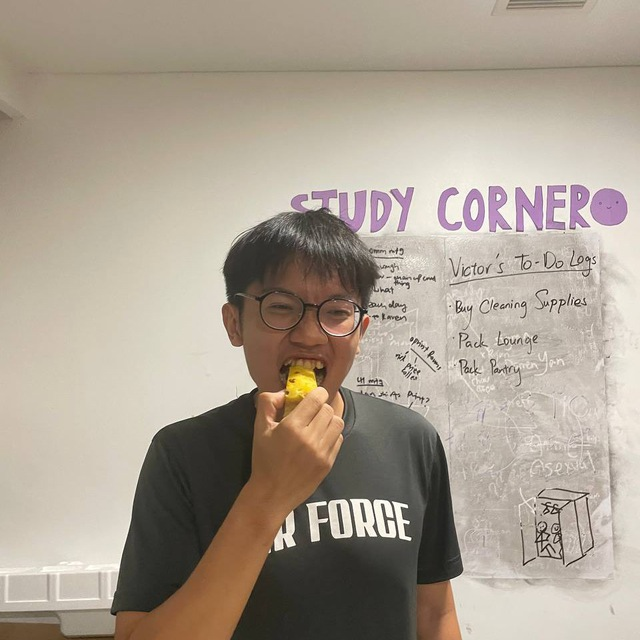
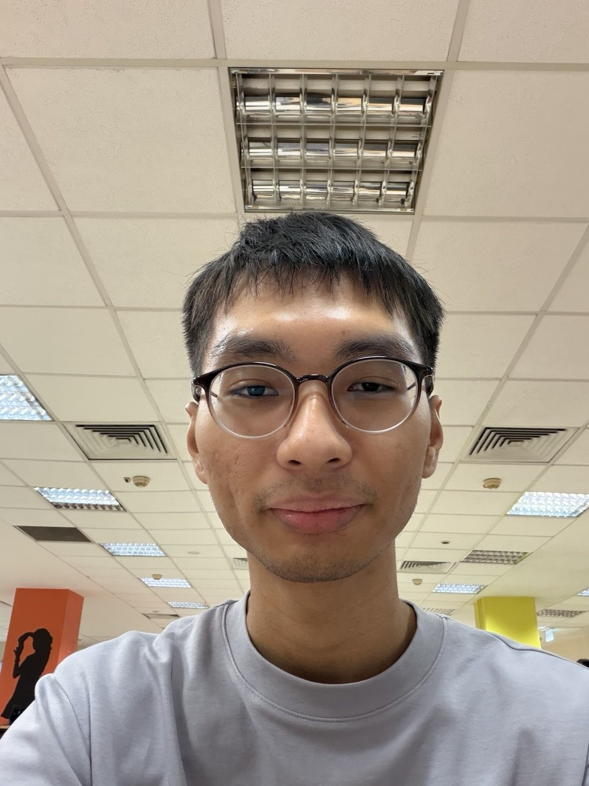

We are a team based in the [School of Computing, National University of Singapore](https://www.comp.nus.edu.sg).

You can reach us at the email `seer[at]comp.nus.edu.sg`

## Project team

### John Doe

[[homepage](http://www.comp.nus.edu.sg/~damithch)]
[[github](https://github.com/johndoe)]
[[portfolio](team/johndoe.md)]

* Role: Project Advisor

### Jane Doe

[[github](http://github.com/johndoe)]
[[portfolio](team/johndoe.md)]

* Role: Team Lead
* Responsibilities: UI

### Foo Kee Juan

[[github](http://github.com/keejuanfoo)]]

* Role: Developer
* Responsibilities: Data

### Ling Si Han

[[github](https://github.com/LINGSIHAN)]

* Role: Developer
* Responsibilities: Dev Ops + Threading

### Wee Yen Zhe

[[github](https://github.com/randomwish/)]

* Role: Developer
* Responsibilities: UI

### Way Yan

[[homepage](https://wyan.win)]
[[github](http://github.com/greysome)]

* Role: Developer
* Responsibilities: UI
