* Table of Contents
{:toc}

--------------------------------------------------------------------------------------------------------------------

## **Acknowledgements**

* TutorReach is based on the [AddressBook-Level3](https://se-education.org/addressbook-level3/) project created by the [SE-EDU initiative](https://se-education.org).
* Libraries used: [JavaFX](https://openjfx.io/), [Jackson](https://github.com/FasterXML/jackson), [JUnit5](https://github.com/junit-team/junit5)

--------------------------------------------------------------------------------------------------------------------

## **Setting up, getting started**

Refer to the guide [_Setting up and getting started_](SettingUp.md).

--------------------------------------------------------------------------------------------------------------------

## **Design**

:bulb: **Tip:** The `.puml` files used to create diagrams are in `docs/diagrams`. Refer to the [_PlantUML Tutorial_ at se-edu/guides](https://se-education.org/guides/tutorials/plantUml.html) to learn how to create and edit diagrams.

### Architecture

The ***Architecture Diagram*** given above explains the high-level design of the App.

The following provides a quick overview of the main components and their interactions.

**Main components of the architecture**

**`Main`** (consisting of classes [`Main`](https://github.com/AY2627S1-CS2103T-F13-1/tp/tree/master/src/main/java/seedu/address/Main.java) and [`MainApp`](https://github.com/AY2627S1-CS2103T-F13-1/tp/tree/master/src/main/java/seedu/address/MainApp.java)) is in charge of the app launch and shut down.
* At app launch, it initializes the other components in the correct sequence, and connects them up with each other.
* At shut down, it shuts down the other components and invokes cleanup methods where necessary.

The bulk of the app's work is done by the following four components:

* [**`UI`**](#ui-component): The UI of the App.
* [**`Logic`**](#logic-component): The command executor.
* [**`Model`**](#model-component): Holds the data of the App in memory.
* [**`Storage`**](#storage-component): Reads data from, and writes data to, the hard disk.

[**`Commons`**](#common-classes) represents a collection of classes used by multiple other components.

**How the architecture components interact with each other**

The *Sequence Diagram* below shows how the components interact with each other for the scenario where the user issues the command `deletestudent 1`.

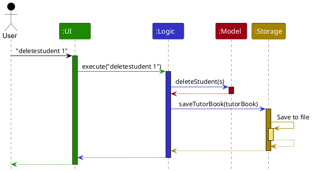

Each of the four main components (also shown in the diagram above),

* defines its *API* in an `interface` with the same name as the Component.
* provides its functionality through a concrete `{Component Name}Manager` class that implements the corresponding API interface.

For example, the `Logic` component defines its API in `Logic.java` and implements it in `LogicManager.java`. Other components interact with a component through its interface rather than its concrete class, preventing them from coupling to that component's implementation, as illustrated in the following partial class diagram.

The sections below give more details of each component.

### UI component

The **API** of this component is specified in [`Ui.java`](https://github.com/AY2627S1-CS2103T-F13-1/tp/tree/master/src/main/java/seedu/address/ui/Ui.java)

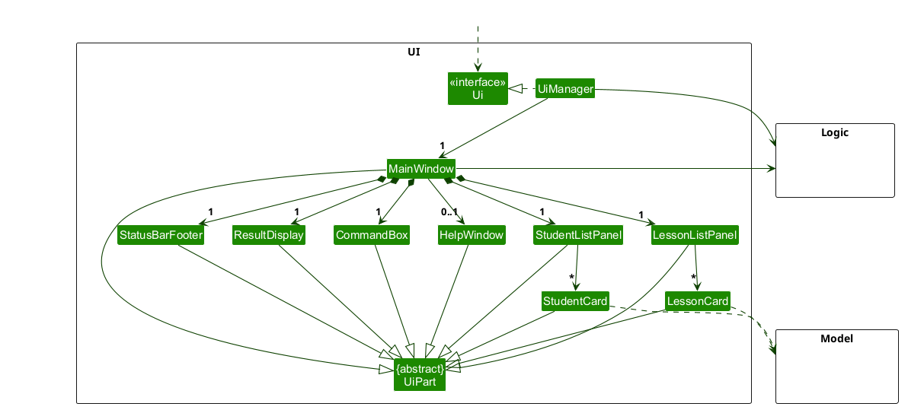

The UI consists of a `MainWindow` and its parts, such as `CommandBox`, `ResultDisplay`, `StudentListPanel`, `LessonListPanel` and `StatusBarFooter`. All of these, including `MainWindow`, inherit from the abstract `UiPart` class, which captures common behavior among classes that represent visible GUI parts.

The `StudentListPanel` and `LessonListPanel` are shown side by side. Each holds one card per item in its list: a `StudentCard` shows a student's phone number, guardian and enrolled lessons, and a `LessonCard` shows a lesson's day, time and enrolled students.

The `UI` component uses the JavaFX UI framework. The layouts of these UI parts are defined in matching `.fxml` files in `src/main/resources/view`. For example, [`MainWindow.fxml`](https://github.com/AY2627S1-CS2103T-F13-1/tp/tree/master/src/main/resources/view/MainWindow.fxml) specifies the layout of [`MainWindow`](https://github.com/AY2627S1-CS2103T-F13-1/tp/tree/master/src/main/java/seedu/address/ui/MainWindow.java).

The `UI` component,

* executes user commands using the `Logic` component.
* listens for changes to `Model` data so that the UI can be updated with the modified data.
* keeps a reference to the `Logic` component, because the `UI` relies on the `Logic` to execute commands.
* depends on some classes in the `Model` component because it displays `Student` and `Lesson` objects from the model.

### Logic component

**API** : [`Logic.java`](https://github.com/AY2627S1-CS2103T-F13-1/tp/tree/master/src/main/java/seedu/address/logic/Logic.java)

Here's a (partial) class diagram of the `Logic` component:

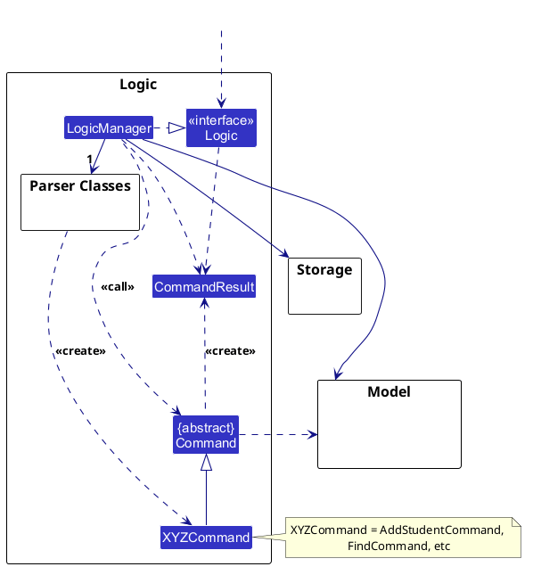

The sequence diagram below illustrates the interactions within the `Logic` component, taking `execute("deletestudent 1")` API call as an example.

:information_source: **Note:** The lifeline for `DeleteStudentCommandParser` should end at the destroy marker (X), but due to a limitation of PlantUML, it continues to the end of the diagram.

How the `Logic` component works:

1. When `Logic` is called upon to execute a command, the command is passed to a `TutorBookParser` object, which in turn creates a parser that matches the command (e.g., `DeleteStudentCommandParser`) and uses it to parse the command.
1. This results in a `Command` object (more precisely, an object of one of its subclasses e.g., `DeleteStudentCommand`) which is executed by the `LogicManager`.
1. The command can communicate with the `Model` when it is executed (e.g. to delete a student). 
   Note that although this is shown as a single step in the diagram above for simplicity, the code can require several interactions between the command object and the `Model` to complete the operation.
1. The result of the command execution is encapsulated as a `CommandResult` object which is returned from `Logic`.

Here are the other classes in `Logic` (omitted from the class diagram above) that are used for parsing a user command:

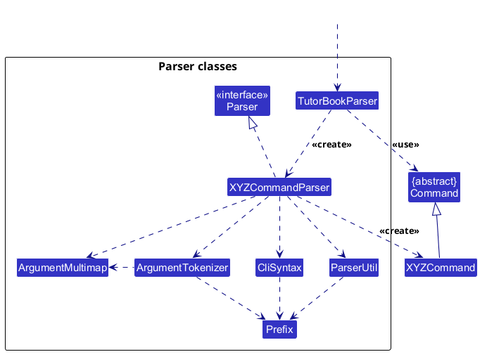

How the parsing works:
* When called upon to parse a user command, the `TutorBookParser` class creates an `XYZCommandParser` (`XYZ` is a placeholder for the specific command name, e.g., `AddStudentCommandParser`). The parser uses the other classes shown above to parse the user command and create an `XYZCommand` object (e.g., `AddStudentCommand`). The `TutorBookParser` returns that object as a `Command` object.
* All `XYZCommandParser` classes, such as `AddStudentCommandParser` and `DeleteStudentCommandParser`, implement the `Parser` interface so they can be treated similarly where appropriate, for example during testing.

### Model component
**API** : [`Model.java`](https://github.com/AY2627S1-CS2103T-F13-1/tp/tree/master/src/main/java/seedu/address/model/Model.java)

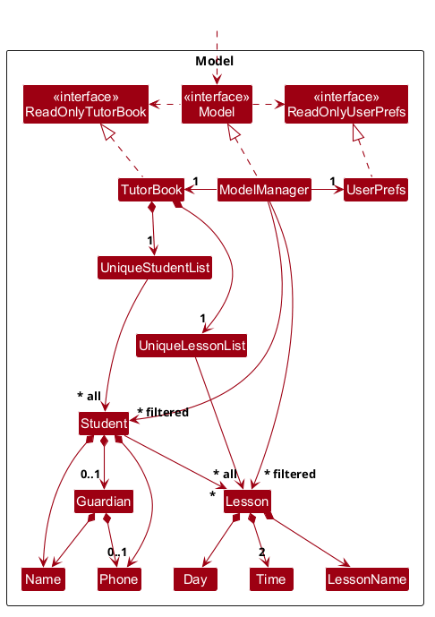

The `Model` component,

* stores the tutor book data i.e., all `Student` objects (which are contained in a `UniqueStudentList` object) and all `Lesson` objects (which are contained in a `UniqueLessonList` object).
* stores each student's guardian, if any, as a `Guardian` object inside that `Student`, rather than as a separate contact.
* records an enrolment by having the `Student` hold references to the `Lesson` objects they attend. The students in a lesson are found by checking which students hold that lesson.
* stores the `Student` objects selected by the current filter, such as search results or the students in one lesson, in a separate _filtered_ list. It exposes this list as an unmodifiable `ObservableList<Student>` that the UI can observe and bind to, so the UI updates when the list changes. The `Lesson` objects selected by the current filter, such as the lessons on one day, are exposed in the same way as an `ObservableList<Lesson>`.
* stores a `UserPrefs` object that represents the user’s preferences (currently, just the GUI settings). This is exposed to the outside as a `ReadOnlyUserPrefs` object.
* does not depend on any of the other three components (as the `Model` represents data entities of the domain, they should make sense on their own without depending on other components)

:information_source: **Note:** An alternative design, shown below, keeps enrolments in a separate `EnrolmentList` in `TutorBook`, where each `Enrolment` links one `Student` to one `Lesson`. This keeps `Student` and `Lesson` independent of each other, but every operation on a student's lessons must then search the enrolment list. See [Enrolling a student in a lesson](#proposed-enrolling-a-student-in-a-lesson) for the comparison. 

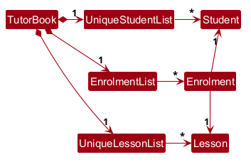

### Storage component

**API** : [`Storage.java`](https://github.com/AY2627S1-CS2103T-F13-1/tp/tree/master/src/main/java/seedu/address/storage/Storage.java)

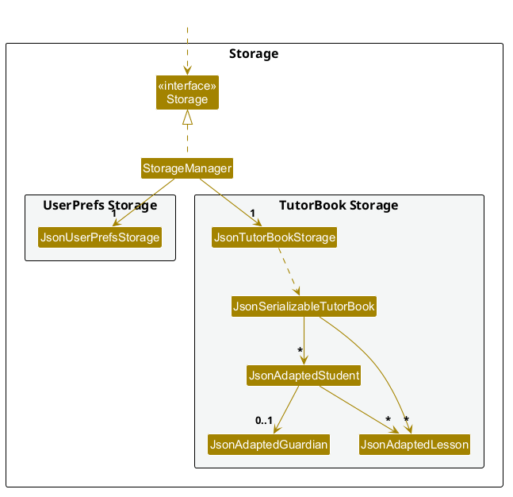

The `Storage` component,
* can save both tutor book data and user preference data in JSON format, and read them back into corresponding objects.
* is implemented by `StorageManager`, which delegates the actual JSON file access to `JsonTutorBookStorage` and `JsonUserPrefsStorage` (one class per data file).
* saves each student's enrolled lessons by their name, day, start time and end time. When the data is read back, each of these must match a lesson in the saved lesson list; otherwise the data file is treated as invalid.
* depends on some classes in the `Model` component (because the `Storage` component's job is to save/retrieve objects that belong to the `Model`)

### Common classes

Classes used by multiple components are in the `seedu.address.commons` package.

--------------------------------------------------------------------------------------------------------------------

## **Implementation**

This section describes some noteworthy details on how certain features are implemented.

### \[Proposed\] Enrolling a student in a lesson

#### Proposed Implementation

The proposed `enrol` command links a student to a lesson. It is facilitated by `EnrolCommand`, `EnrolCommandParser` and the following `Model` operations:

* `Model#hasEnrolment(Student, Lesson)` — Checks whether the student is already enrolled in the lesson.
* `Model#enrolStudent(Student, Lesson)` — Replaces the student with a copy that also holds the lesson.

Given below is an example usage scenario and how the enrolment mechanism behaves at each step.

Step 1. The user executes `liststudents` and `listlessons`, so that the student and the lesson are both shown in their panels.

Step 2. The user executes `enrol s/1 l/2`. `EnrolCommandParser` checks that both `s/` and `l/` are present exactly once and that each value is a positive integer, then creates an `EnrolCommand` with the two indices.

Step 3. `EnrolCommand#execute()` looks up the 1st student in the filtered student list and the 2nd lesson in the filtered lesson list. If either index is out of range, it throws a `CommandException`, checking the student index first.

Step 4. The command calls `Model#hasEnrolment()`. If the student already holds the lesson, it throws a `CommandException` naming both the student and the lesson.

Step 5. Otherwise, the command calls `Model#enrolStudent()`. Since `Student` is immutable, this creates a new `Student` with the same details and the lesson added to its lesson set, and replaces the old one in the `UniqueStudentList`. Both panels update, because the `StudentCard` lists the student's lessons and the `LessonCard` lists the students holding that lesson.

Deleting a student needs no extra work, since their enrolments are removed along with them. Deleting a lesson (`deletelesson`) must also replace every student holding that lesson with a copy that no longer holds it.

#### Design considerations:

**Aspect: Where enrolments are stored:**

* **Alternative 1 (current choice):** Each `Student` holds the set of `Lesson` objects they are enrolled in.
  * Pros: Showing a student's lessons is direct, and saving follows the same pattern as other fields of `Student`.
  * Cons: Showing a lesson's students requires checking every student. Deleting a lesson requires updating every student enrolled in it.

* **Alternative 2:** Each `Lesson` holds the set of `Student` objects enrolled in it.
  * Pros: Showing a lesson's students is direct.
  * Cons: Students have no unique identifier (two students may share a name), so a saved lesson cannot refer to its students reliably. Editing or deleting a student requires updating every lesson they are in.

* **Alternative 3:** A separate `EnrolmentList` of `Enrolment` objects, each linking one student to one lesson.
  * Pros: `Student` and `Lesson` stay independent of each other.
  * Cons: More classes to maintain, and the same identifier problem as Alternative 2 when saving.

### \[Proposed\] Undo/redo feature

#### Proposed Implementation

The proposed undo/redo mechanism is facilitated by `VersionedTutorBook`. It extends `TutorBook` with an undo/redo history, stored internally as a `tutorBookStateList` and `currentStatePointer`. Additionally, it implements the following operations:

* `VersionedTutorBook#commit()` — Saves the current tutor book state in its history.
* `VersionedTutorBook#undo()` — Restores the previous tutor book state from its history.
* `VersionedTutorBook#redo()` — Restores a previously undone tutor book state from its history.

These operations are exposed in the `Model` interface as `Model#commitTutorBook()`, `Model#undoTutorBook()` and `Model#redoTutorBook()` respectively.

Given below is an example usage scenario and how the undo/redo mechanism behaves at each step.

Step 1. The user launches the application for the first time. The `VersionedTutorBook` will be initialized with the initial tutor book state, and the `currentStatePointer` pointing to that single tutor book state.

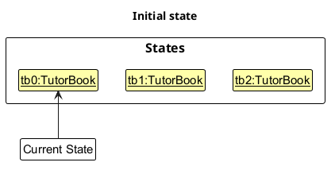

Step 2. The user executes `deletestudent 5` command to delete the 5th student in the tutor book. The `deletestudent` command calls `Model#commitTutorBook()`, causing the modified state of the tutor book after the `deletestudent 5` command executes to be saved in the `tutorBookStateList`, and the `currentStatePointer` is shifted to the newly inserted tutor book state.

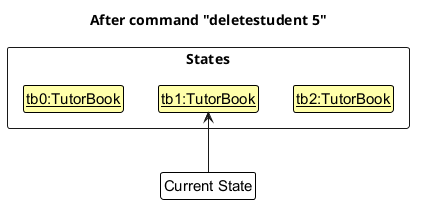

Step 3. The user executes `addstudent n/David …​` to add a new student. The `addstudent` command also calls `Model#commitTutorBook()`, causing another modified tutor book state to be saved into the `tutorBookStateList`.

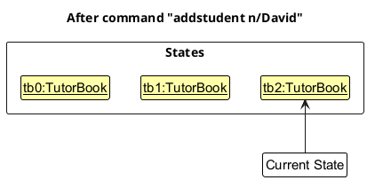

:information_source: **Note:** If a command fails its execution, it will not call `Model#commitTutorBook()`, so the tutor book state will not be saved into the `tutorBookStateList`.

Step 4. The user now decides that adding the student was a mistake, and decides to undo that action by executing the `undo` command. The `undo` command will call `Model#undoTutorBook()`, which will shift the `currentStatePointer` once to the left, pointing it to the previous tutor book state, and restores the tutor book to that state.

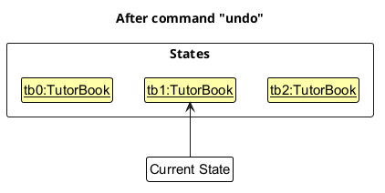

:information_source: **Note:** If the `currentStatePointer` is at index 0, pointing to the initial tutor book state, then there are no previous tutor book states to restore. The `undo` command uses `Model#canUndoTutorBook()` to check if this is the case. If so, it will return an error to the user rather
than attempting to perform the undo.

The following sequence diagram shows how an undo operation goes through the `Logic` component:

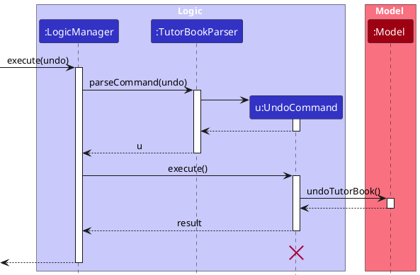

:information_source: **Note:** The lifeline for `UndoCommand` should end at the destroy marker (X), but due to a limitation of PlantUML, it continues to the end of the diagram.

Similarly, how an undo operation goes through the `Model` component is shown below:

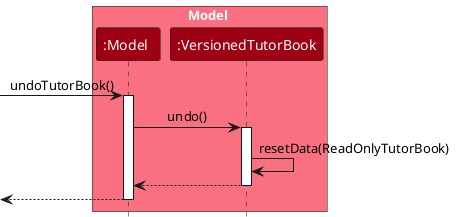

The `redo` command does the opposite — it calls `Model#redoTutorBook()`, which shifts the `currentStatePointer` once to the right, pointing to the previously undone state, and restores the tutor book to that state.

:information_source: **Note:** If the `currentStatePointer` is at index `tutorBookStateList.size() - 1`, pointing to the latest tutor book state, then there are no undone tutor book states to restore. The `redo` command uses `Model#canRedoTutorBook()` to check if this is the case. If so, it will return an error to the user rather than attempting to perform the redo.

Step 5. The user then decides to execute the command `liststudents`. Commands that do not modify the tutor book, such as `liststudents`, will usually not call `Model#commitTutorBook()`, `Model#undoTutorBook()` or `Model#redoTutorBook()`. Thus, the `tutorBookStateList` remains unchanged.

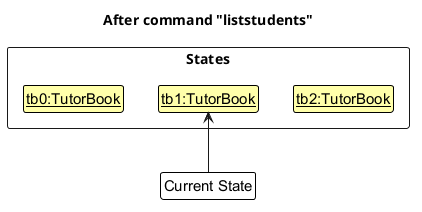

Step 6. The user executes `addlesson n/Sec 1 Math …​`, which calls `Model#commitTutorBook()`. Since the `currentStatePointer` is not pointing at the end of the `tutorBookStateList`, all tutor book states after the `currentStatePointer` will be purged. Reason: It no longer makes sense to redo the `addstudent n/David …​` command. This is the behavior that most modern desktop applications follow.

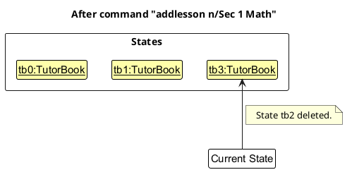

The following activity diagram summarizes what happens when a user executes a new command:

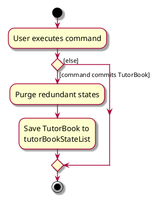

#### Design considerations:

**Aspect: How undo & redo execute:**

* **Alternative 1 (current choice):** Saves the entire tutor book.
  * Pros: Easy to implement.
  * Cons: May have performance issues in terms of memory usage.

* **Alternative 2:** Individual command knows how to undo/redo by
  itself.
  * Pros: Will use less memory (e.g. for `deletestudent`, just save the student being deleted).
  * Cons: We must ensure that the implementation of each individual command is correct. Commands with side effects, such as `deletelesson` removing the lesson from every enrolled student, are harder to reverse correctly.

--------------------------------------------------------------------------------------------------------------------

## **Documentation, logging, testing, dev-ops**

* [Documentation guide](Documentation.md)
* [Testing guide](Testing.md)
* [Logging guide](Logging.md)
* [DevOps guide](DevOps.md)

--------------------------------------------------------------------------------------------------------------------

## **Appendix: Requirements**

### Product scope

**Target user profile**:

* is an independent private tutor who teaches secondary-school students
* has to keep track of many students, along with their parents' or guardians' contact details
* teaches several weekly lessons, each with a different group of students
* often needs to contact a student or their guardian quickly
* prefers desktop apps over other types of applications
* can type fast and prefers typing to mouse interactions
* is reasonably comfortable using CLI apps

**Value proposition**: Help independent private tutors organise and quickly retrieve student and guardian contact details, reducing the effort needed to manage multiple students and communicate with the right family.

### User stories

Priorities: High (must have) - `* * *`, Medium (nice to have) - `* *`, Low (unlikely to have) - `*`

| Priority | As a …​                                   | I want to …​                                                     | So that I can…​                                                                  |
|----------|-------------------------------------------|------------------------------------------------------------------|----------------------------------------------------------------------------------|
| `* * *`  | new user                                  | see usage instructions                                           | refer to instructions when I forget how to use the app                           |
| `* * *`  | tutor                                     | add a student with their contact details                         | start storing my students' contact details                                       |
| `* * *`  | tutor                                     | add a guardian's contact details to a student                    | reach the student's family when the student has no phone of their own            |
| `* * *`  | tutor                                     | see at a glance which details belong to a student and which to a guardian | tell whom I am calling before I call                                    |
| `* * *`  | tutor                                     | delete a student                                                 | remove students who have stopped lessons                                         |
| `* * *`  | tutor                                     | view all my students with their contact details                  | see what information I have stored                                               |
| `* * *`  | tutor                                     | find a student by name                                           | retrieve their contact details without browsing the entire list                  |
| `* * *`  | tutor                                     | find students by their guardian's name                           | tell which student a guardian's message is about                                 |
| `* * *`  | tutor                                     | add a weekly lesson with its day and time                        | organise my students by the lessons they attend                                  |
| `* * *`  | tutor                                     | delete a lesson                                                  | remove lessons that no longer run                                                |
| `* * *`  | tutor                                     | view all my lessons and the students in each                     | see how my students are organised                                                |
| `* * *`  | tutor                                     | enrol a student in a lesson                                      | keep track of which students attend which lesson                                 |
| `* * *`  | tutor                                     | view the students in a particular lesson                         | contact the families relevant to that lesson                                     |
| `* * *`  | tutor                                     | have my data saved automatically                                 | keep my records without having to save them manually                             |
| `* *`    | tutor                                     | view only the lessons on a particular day                        | focus on the lessons I teach that day                                            |
| `* *`    | tutor                                     | remove a student from a lesson                                   | correct a wrong enrolment or record a student leaving one lesson                 |
| `* *`    | tutor                                     | edit a student's or guardian's details                           | correct inaccurate or outdated details                                           |
| `* *`    | tutor                                     | edit a lesson's details                                          | update a lesson that has moved to a different day or time                        |
| `* *`    | tutor                                     | undo my most recent change                                       | recover from an accidental addition, edit or deletion                            |
| `* *`    | tutor                                     | add more than one guardian to a student                          | store the contact details of both parents                                        |
| `* *`    | tutor of a student with several guardians | mark one guardian as the primary contact                         | know whom to contact first                                                       |
| `* *`    | tutor                                     | copy a phone number or email address                             | paste it into my preferred messaging app                                         |
| `* *`    | tutor                                     | record a contact's email address                                 | reach families who prefer email                                                  |
| `* *`    | tutor                                     | record a contact's preferred communication method                | reach them in the way they prefer                                                |
| `* *`    | home tutor                                | record a student's lesson location                               | remember where each student's lessons are held                                   |
| `* *`    | tutor who teaches several subjects        | record the subject I teach each student                          | avoid confusing students with similar names or in similar lessons                |
| `* *`    | expert user                               | filter students using several criteria at once                   | quickly narrow down a long list of students                                      |
| `* *`    | expert user                               | enrol or remove several students in one command                  | manage enrolment changes efficiently                                             |
| `*`      | detail-oriented tutor                     | add private notes to a student                                   | record useful information that does not belong in their contact details          |
| `*`      | tutor                                     | be warned when a new lesson clashes with an existing one         | avoid double-booking myself                                                      |
| `*`      | tutor                                     | archive students who have stopped lessons                        | keep their details for future reference without cluttering my list              |

### Use cases

(For all use cases below, the **System** is `TutorReach` and the **Actor** is the `tutor`, unless specified otherwise)

**Use case: UC01 - Add a student**

**MSS**

1.  Tutor requests to add a student, giving the student's name and at least one phone number (the student's, or a guardian's name and phone number).
2.  TutorReach adds the student and shows the added student's details.

    Use case ends.

**Extensions**

* 1a. A required detail is missing, or a guardian's name is given without a phone number (or vice versa).

    * 1a1. TutorReach shows an error message.

      Use case resumes at step 1.

* 1b. A given detail is invalid.

    * 1b1. TutorReach shows an error message.

      Use case resumes at step 1.

* 1c. The student already exists in TutorReach.

    * 1c1. TutorReach shows an error message.

      Use case ends.

**Use case: UC02 - Delete a student**

**MSS**

1.  Tutor requests to list students.
2.  TutorReach shows a list of students.
3.  Tutor requests to delete a specific student in the list.
4.  TutorReach deletes the student, removes them from all their lessons, and shows the deleted student's details.

    Use case ends.

**Extensions**

* 1a. Tutor requests to find students by name instead (UC05).

  Use case resumes at step 2.

* 2a. The list is empty.

  Use case ends.

* 3a. The given index is invalid.

    * 3a1. TutorReach shows an error message.

      Use case resumes at step 2.

**Use case: UC03 - Add a lesson**

**MSS**

1.  Tutor requests to add a lesson, giving its name, day, start time and end time.
2.  TutorReach adds the lesson and shows the added lesson's details.

    Use case ends.

**Extensions**

* 1a. A required detail is missing.

    * 1a1. TutorReach shows an error message.

      Use case resumes at step 1.

* 1b. A given detail is invalid, or the end time is not later than the start time.

    * 1b1. TutorReach shows an error message.

      Use case resumes at step 1.

* 1c. A lesson with the same name, day, start time and end time already exists.

    * 1c1. TutorReach shows an error message.

      Use case ends.

**Use case: UC04 - Enrol a student in a lesson**

**MSS**

1.  Tutor requests to list students.
2.  TutorReach shows a list of students.
3.  Tutor requests to list lessons.
4.  TutorReach shows a list of lessons.
5.  Tutor requests to enrol a specific student in the student list in a specific lesson in the lesson list.
6.  TutorReach enrols the student in the lesson and shows the student's and lesson's names.

    Use case ends.

**Extensions**

* 1a. Tutor requests to find students by name instead (UC05).

  Use case resumes at step 2.

* 2a. The list of students is empty.

  Use case ends.

* 4a. The list of lessons is empty.

    * 4a1. Tutor adds a lesson (UC03).

      Use case resumes at step 3.

* 5a. The given student index or lesson index is invalid.

    * 5a1. TutorReach shows an error message.

      Use case resumes at step 5.

* 5b. The student is already enrolled in the lesson.

    * 5b1. TutorReach shows an error message.

      Use case ends.

**Use case: UC05 - Find a student by name**

**MSS**

1.  Tutor requests to find students whose names contain the given keywords.
2.  TutorReach shows the matching students with their own and their guardians' contact details.

    Use case ends.

**Extensions**

* 1a. Tutor gives keywords for the guardian's name instead of, or as well as, the student's name.

  Use case resumes at step 2, with TutorReach matching students against all the given keywords.

* 1b. No keywords are given.

    * 1b1. TutorReach shows an error message.

      Use case resumes at step 1.

* 2a. No student matches the keywords.

  Use case ends.

**Use case: UC06 - Contact the families of students in a lesson**

**MSS**

1.  Tutor requests to list the lessons on a particular day.
2.  TutorReach shows the lessons on that day.
3.  Tutor requests to list the students in a specific lesson in the list.
4.  TutorReach shows the students in that lesson with their own and their guardians' contact details.
5.  Tutor contacts the families using the contact details shown.

    Use case ends.

**Extensions**

* 1a. The given day is invalid.

    * 1a1. TutorReach shows an error message.

      Use case resumes at step 1.

* 2a. There are no lessons on that day.

  Use case ends.

* 3a. The given index is invalid.

    * 3a1. TutorReach shows an error message.

      Use case resumes at step 2.

* 4a. No students are enrolled in the lesson.

  Use case ends.

**Use case: UC07 - Delete a lesson**

**MSS**

1.  Tutor requests to list lessons.
2.  TutorReach shows a list of lessons.
3.  Tutor requests to delete a specific lesson in the list.
4.  TutorReach deletes the lesson, removes it from its students' records, and shows the deleted lesson's details.

    Use case ends.

**Extensions**

* 2a. The list is empty.

  Use case ends.

* 3a. The given index is invalid.

    * 3a1. TutorReach shows an error message.

      Use case resumes at step 2.

### Non-Functional Requirements

1.  Should work on any _mainstream OS_ as long as it has Java `25` or above installed.
2.  Should be able to hold up to 1000 students and 200 lessons without any command taking longer than 1 second to complete on a typical laptop.
3.  A user with above average typing speed for regular English text (i.e. not code, not system admin commands) should be able to accomplish most of the tasks faster using commands than using the mouse.
4.  Should work without an internet connection.
5.  Should save the data after every command that changes it, so that no data is lost if the app is closed or the computer shuts down unexpectedly after that command.
6.  Should store the data locally in a human-editable text file, so that advanced users can edit or back up the data directly.
7.  Should not send any student or guardian data off the user's computer.
8.  Should run from a single JAR file without an installer, and the JAR file should not exceed 100MB.
9.  Should be used by a single user on one computer; it does not need to support sharing data between users.
10. The GUI should work well (i.e., no resizing needed to use all features) for screen resolutions of 1920x1080 and higher at screen scales of 100% and 125%, and be usable (i.e., all features can be used, even if not optimally) at 1280x720 and higher at a screen scale of 150%.
11. Should show an error message that states the problem and the correct command format when a command is invalid, instead of crashing.

### Glossary

* **Mainstream OS**: Windows, Linux, Unix, or macOS
* **Tutor**: The user of TutorReach; an independent private tutor
* **Student**: A person the tutor teaches; stored with their name, an optional phone number and an optional guardian
* **Guardian**: A parent or other adult responsible for a student, stored as part of that student's record with a name and phone number
* **Lesson**: A weekly time slot in which the tutor teaches a group of students, identified by its name, day, start time and end time
* **Enrol**: To link a student to a lesson, recording that the student attends that lesson
* **Index**: The number shown next to a student or lesson in the currently displayed list, used in commands to refer to that student or lesson
* **Duplicate student**: A student whose name matches an existing student's (ignoring case and extra spaces) and who shares at least one phone number with them, counting both student and guardian phone numbers
* **Duplicate lesson**: A lesson whose name (ignoring case and extra spaces), day, start time and end time all match an existing lesson's

--------------------------------------------------------------------------------------------------------------------

## **Appendix: Instructions for manual testing**

Given below are instructions to test the app manually.

:information_source: **Note:** These instructions only provide a starting point for testers to work on;
testers are expected to do more *exploratory* testing.

### Launch and shutdown

1. Initial launch

   1. Download the JAR file and copy it into an empty folder.

   1. Double-click the JAR file. 
      Expected: The GUI opens with a set of sample students and lessons. The window size may not be optimal.

1. Saving window preferences

   1. Resize the window to an optimal size. Move the window to a different location. Close the window.

   1. Relaunch the app by double-clicking the JAR file. 
       Expected: The most recent window size and location are retained.

1. Shutting down

   1. Test case: `exit` 
      Expected: The app closes.

### Adding a student

1. Adding a student while all students are being shown

   1. Prerequisites: List all students using the `liststudents` command.

   1. Test case: `addstudent n/Aiden Tan gn/Tan Mei Ling gp/91234567` 
      Expected: A student card for Aiden Tan is added at the end of the students panel, with no phone of their own and Tan Mei Ling as guardian. The status message shows the added student's details.

   1. Test case: `addstudent n/Ryan Lim p/93210283` 
      Expected: A student with no guardian is added. The status message shows the added student's details.

   1. Test case: `addstudent n/Ryan Lim` 
      Expected: No student is added. The status message states that at least one phone number is required.

   1. Test case: `addstudent n/Ryan Lim gn/Lim Wei` 
      Expected: No student is added. The status message states that guardian name and guardian phone must be given together.

1. Adding a duplicate student

   1. Prerequisites: The test case `addstudent n/Aiden Tan gn/Tan Mei Ling gp/91234567` above has been executed.

   1. Test case: `addstudent n/aiden  tan p/91234567` 
      Expected: No student is added, since the name matches (ignoring case and extra spaces) and a phone number is shared. The status message shows `This student already exists`.

   1. Test case: `addstudent n/Aiden Tan p/88887777` 
      Expected: The student is added, since no phone number is shared.

### Deleting a student

1. Deleting a student while all students are being shown

   1. Prerequisites: List all students using the `liststudents` command, with multiple students in the list.

   1. Test case: `deletestudent 1` 
      Expected: The first student is deleted from the list and removed from every lesson card. The status message shows the deleted student's details.

   1. Test case: `deletestudent 0` 
      Expected: No student is deleted. The status message shows the invalid command format error.

   1. Other incorrect delete commands to try: `deletestudent`, `deletestudent abc`, `deletestudent 1 2`, `deletestudent x` (where x is larger than the list size) 
      Expected: Similar to previous.

1. Deleting a student while the students panel is filtered

   1. Prerequisites: Show only some students, e.g. using `findstudent n/tan`.

   1. Test case: `deletestudent 1` 
      Expected: The first student shown is deleted. The filter stays on.

### Adding and deleting a lesson

1. Adding a lesson

   1. Test case: `addlesson n/Sec 3 A-Math d/mon st/1600 et/1800` 
      Expected: A lesson card for Sec 3 A-Math (Mon 1600-1800) with no students is added at the end of the lessons panel.

   1. Test case: the same command again 
      Expected: No lesson is added. The status message shows `This lesson already exists`.

   1. Test case: `addlesson n/Sec 3 A-Math d/mon st/1800 et/1600` 
      Expected: No lesson is added. The status message states that the end time must be later than the start time.

   1. Other incorrect commands to try: `addlesson n/Math d/tues st/1600 et/1800`, `addlesson n/Math d/mon st/4pm et/1800`, `addlesson n/Math d/mon st/2400 et/2430` 
      Expected: No lesson is added. The status message shows the error for the invalid value.

1. Deleting a lesson

   1. Prerequisites: List all lessons using `listlessons`. The first lesson has at least one student enrolled.

   1. Test case: `deletelesson 1` 
      Expected: The first lesson is deleted. Its enrolled students are kept, but the lesson is removed from their cards.

   1. Test case: `deletelesson 0` 
      Expected: No lesson is deleted. The status message shows the invalid command format error.

### Enrolling a student in a lesson

1. Enrolling a student

   1. Prerequisites: List all students and lessons using `liststudents` and `listlessons`, with at least one of each. The first student is not enrolled in the first lesson.

   1. Test case: `enrol s/1 l/1` 
      Expected: The lesson appears on the first student's card, and the student appears on the first lesson's card.

   1. Test case: `enrol s/1 l/1` again 
      Expected: No change. The status message states that the student is already enrolled in the lesson.

   1. Test case: `enrol 1 1` 
      Expected: No change. The status message shows the invalid command format error.

   1. Test case: `enrol s/x l/1` (where x is larger than the number of students shown) 
      Expected: No change. The status message shows `The student index provided is invalid`.

### Viewing and finding students

1. Viewing the students in a lesson

   1. Prerequisites: At least one lesson is shown, with students enrolled.

   1. Test case: `liststudents l/1` 
      Expected: Only the students enrolled in the first lesson are shown, and the status message states how many.

   1. Test case: `liststudents 1` 
      Expected: The list is unchanged. The status message shows the invalid command format error.

1. Finding students

   1. Test case: `findstudent gn/tan` 
      Expected: Only students whose guardian's name contains "tan" are shown.

   1. Test case: `findstudent n/` 
      Expected: The list is unchanged. The status message states that the search text cannot be empty.

### Saving data

1. Dealing with missing data files

   1. Close the app. Delete the `data/tutorreach.json` file in the folder containing the JAR file.

   1. Launch the app. 
      Expected: The app starts with the sample students and lessons.

1. Dealing with corrupted data files

   1. Close the app. Open `data/tutorreach.json` and make it invalid, e.g. delete a closing `}`, or change a student's enrolled lesson so that it matches no lesson in the lesson list.

   1. Launch the app. 
      Expected: The app starts with no students and no lessons, and does not crash.
