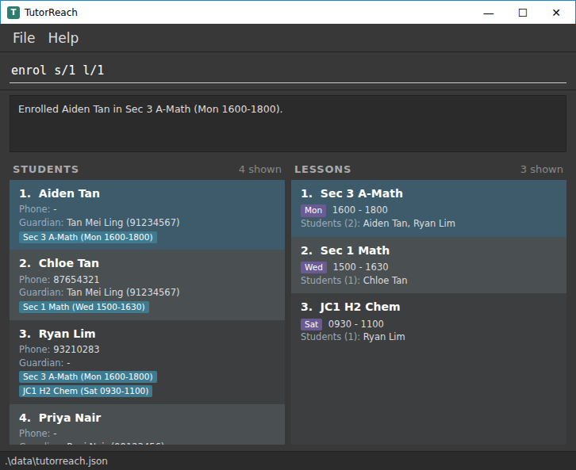

**TutorReach is a desktop app for independent private tutors to manage the contact details of their students and their students' guardians.** Students can be grouped into the lessons you teach, so you can quickly find and contact the right family. While it has a GUI, most of the user interactions happen using a CLI (Command Line Interface).

* If you are interested in using TutorReach, head over to the [_Quick Start_ section of the **User Guide**](UserGuide.html#quick-start).
* If you are interested in developing TutorReach, the [**Developer Guide**](DeveloperGuide.html) is a good place to start.

**Acknowledgements**

* This project is based on the AddressBook-Level3 project created by the [SE-EDU initiative](https://se-education.org).
* Libraries used: [JavaFX](https://openjfx.io/), [Jackson](https://github.com/FasterXML/jackson), [JUnit5](https://github.com/junit-team/junit5)
